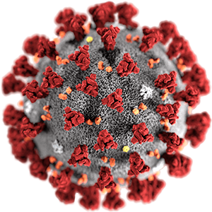
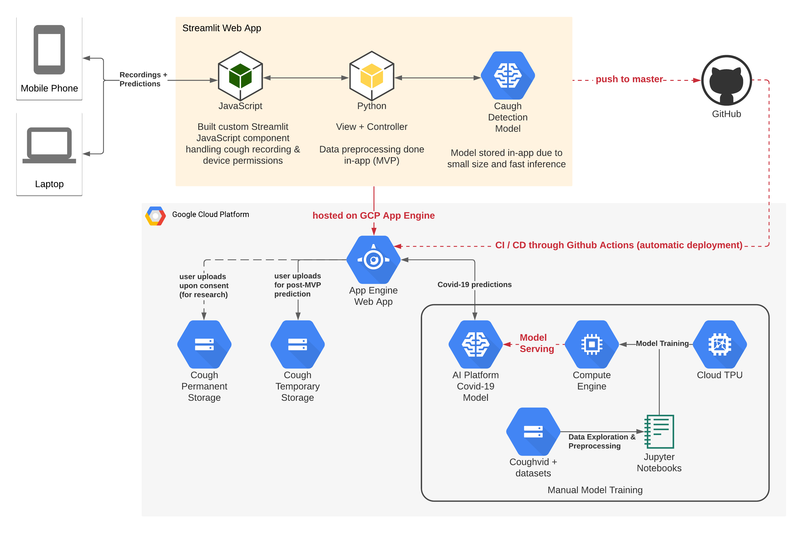
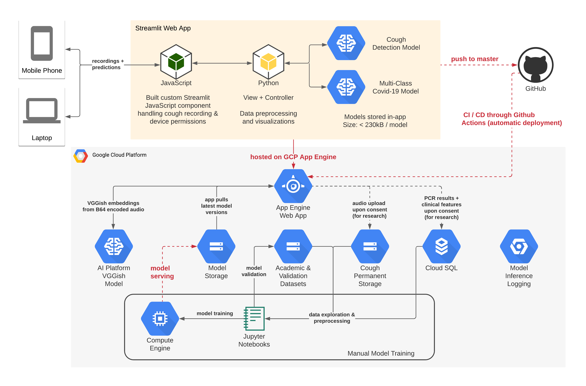

[](https://github.com/LukasHaas/cs329s-covid-prediction/actions/workflows/cloud_run.yml)
[](https://github.com/LukasHaas/cs329s-covid-prediction/actions/workflows/google-flex.yml)

#  Covid-19 Prediction App
This app is a Streamlit front end predicting the risk of Covid-19 based on recorded cough sounds.

## Demo

### Current Deployment - Cloud Run

We currently have the app deployed on GCP Cloud Run. For the older deployment version (which is not reliable), please see the
App Engine deployment.

Scan the QR code below or click the link to see the app in action:


     
[Covid-19 Risk Evaluation App - Cloud Run](https://covid-risk-evaluation-fynom42syq-uc.a.run.app/)

### Old Deployment - App Engine

The below is the old deployment of our app which will soon be removed:

Scan the QR code below or click the link to see the app in action:


     
[Covid-19 Risk Evaluation App - App Engine](https://cs329s-covid-caugh-prediction.appspot.com/)


## Project Setup

### Dependencies
It is recommended to first install all required dependencies using a virtual environment.

Go to the project directory to which you have downloaded all of this repo's files and run:
```shell
cd my-project/
pip install virtualenv
virtualenv venv
```

Now activate the newly created virtual environment:
```shell
source venv/bin/activate
```

Next, you need to install all of the project's dependencies:
```shell
pip install -r requirements.txt
```

### Environment Variables
In order not to expose GCP information to the public, you will need to set some environment variables.

Please create a file called `app_environment.sh` in the project directory and add the following lines to it,
replacing the right side of the equal signs with your GCP project details:
```shell
export GCP_PROJECT=your_project
export GCP_REGION=your_region
export GCP_COUGH_STORAGE=your_storage
export GCP_MODEL=your_model
```

Next run the shell file using source in order to set the environment variables:
```shell
source ./app_environment.sh
```

## Running the Application
Run the following command from your project directory to start the Streamlit app:
```shell
streamlit run app.py
```
This will run the application on your local machine.

Cough sounds will not be saved to any device but are processed using GCP APIs.

## Deployment
In order to deploy the application to Google Cloud's App Engine, run the following command from the root directory of the project:
```shell
make gcloud-deploy-flex
```
This will create a new app version in a "flexible" GCP App Engine environment.

## System Architecture
### MVP
The below diagram illustrates how our system on looked like on Google Cloud Platform when we submitted it for MVP evaluation:


     
### V1: CS 329S Demo 
Since our MVP, we added a lot of features. The below diagram illustrates our current system architecture on Google Cloud Platform:


